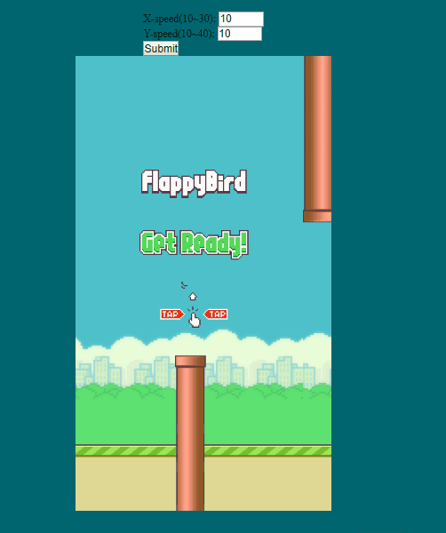

# Web practice 
practice web developing with some programming language:
1. html + css + js 
2. react.js

create some useful application

To start application locally

git clone https://<span></span>github<span></span>.com/Samuel1043/WebPractice.git


## flappy bird 
 A flappy bird game using html,css,js,[p5.js](https://p5js.org/)

#### installation
require python httpserver or other httpserver

```

1. download python from https://www.python.org/downloads/ 
2. cd $directoryof_flappybird 
3. python -m http.server
4. go to localhost:8000 
5. enjoy game!!  
```




## image viewer
a basic image viewer written by html,js,css

just go to the folder and open index.html to see the result


##todoList
a basic todolist written by html,js,css
just go to the folder and open index.html to see the result


##React.js 
require node.js

###installation
```
1. NodeJS install: http://www.runoob.com/nodejs/nodejs-install-setup.html
2. npm install -g create-react-app
```

## itemList 
a basic practice of shoping item list written by reract.js

```
1. cd $itemList_dir
2. npm install
3. npm start
4. go to localhost:3000 to see the result(default)
```


